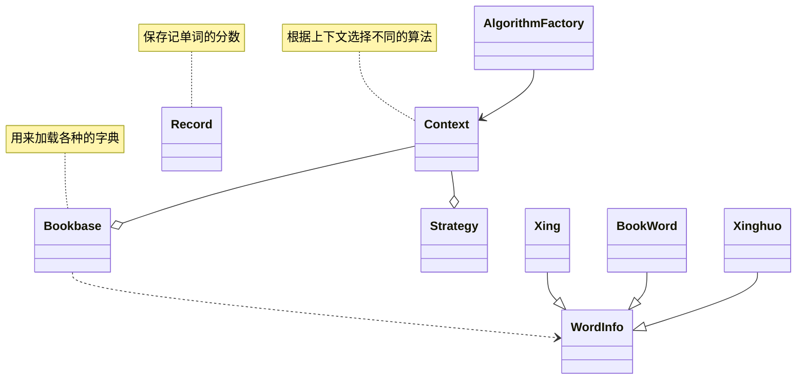
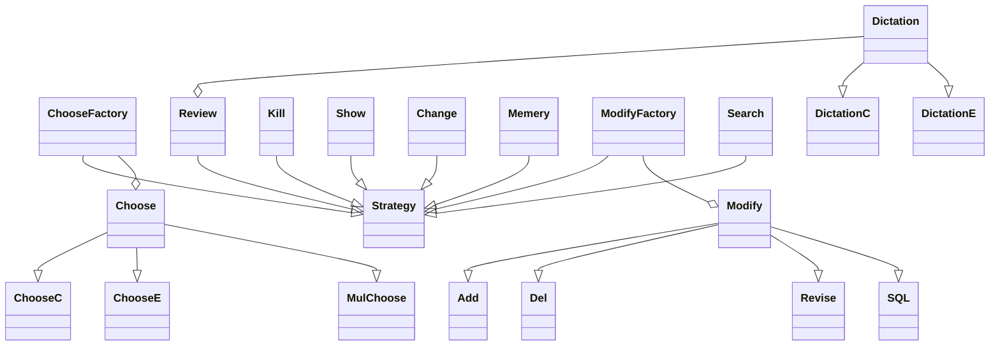

# Word Memory
[English Version](README_en.md)

Word Memory 是一个用于记单词的命令行程序。它可以让你在终端中输入单词、解释和例句，并将其保存到本地文件中，以便后续查看和编辑。你还可以通过查询已保存的单词来进行复习。

使用下面的方法使用源代码。

1. 克隆本仓库到本地。

   ```shell
   $ git clone https://github.com/doctordragon666/Word_Memery.git
   ```

2. 用`visual stdio`打开项目文件，点击`sln`文件，点击运行即可

3. 编译完成后，可以在 `x64` 目录下找到可执行文件 `WordMemery`。

## 软件架构

充分考验对设计模式的使用。

当然这个项目实际上踩了很多的设计模式的坑，比如过早的优化。所以后期不打算优化了，程序太大了，而且类很多很多。光编译的时间就很久。程序要求自己编译，上传的安装包也运行不了，只能在VS中编译是正常的。VS开发这种项目还是很坑的。

程序的主要类图如下



`Strategy`类是个很大的类，这里我再单独开一个类图出来




## 使用说明

在进入程序后，命令行会显示如何使用。显示界面如下

```shell
$ WordMermory.exe 
------------------------------单词系统-----------------------------------
||
||              1.选择题
||              2.默写题
||              3.斩词
||              4.查看记录
||              5.更换词库
||              6.记忆模式
||              7.修改模式
||              8.搜索模式
||              0.退出系统
||                       请输入你的选择：_________

```


## 许可证
本项目采用MIT许可证。